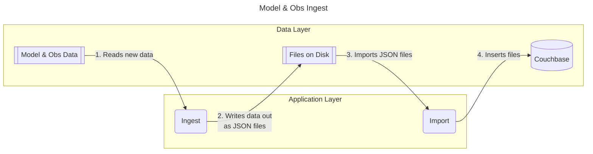
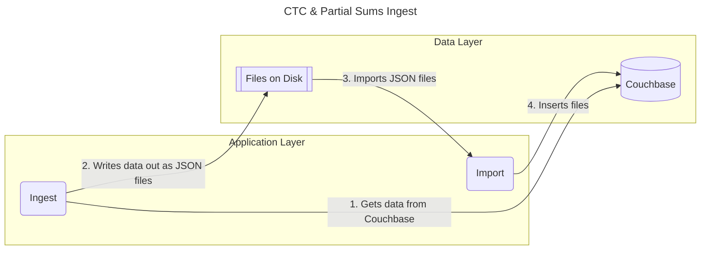

# VxIngest

VxIngest ingests meteorological data from various sources and makes it available in a document database for verification purposes in conjunction with the ["Model Application Toolsuite" (MATS)](https://github.com/noaa-gsl/MATS) application.

## Getting Started

Our ingest process has two components:

* The VxIngest Python application - also referred to as the "ingest"
* The "import" shell script

The ingest program works to consume raw model output and observation data in GRIB & NetCDF format and turn that data into VxIngest's common data format. The ingest program writes the data out to disk as Couchbase JSON documents, along with some log output and Prometheus metrics. The ingest program also works to calculate aggregate statistics on the contents of the Couchbase database, like CTCs & Partial Sums

The import script wraps the Couchbase `cbimport` CLI tool and imports the Couchbase JSON documents created by the "ingest" process into the database.

If you're interested in some diagrams showing the data flow, see the [Diagrams](#diagrams) section

## Usage

VxIngest is containerized for deployment. If you are developing the application, see the [Development Guide](docs/development-guide.md) for information on setting up a development environment; as well as for information on linting, formatting, and testing.

### Using the container

You will first need to build the docker container with the following:

```bash
docker build \
    --build-arg BUILDVER=dev \
    --build-arg COMMITBRANCH=$(git branch --show-current) \
    --build-arg COMMITSHA=$(git rev-parse HEAD) \
    -f ./docker/ingest/Dockerfile \
    -t vxingest:dev \
    .
```

To run the ingest, you will first need to create a file like the below with the database credentials in `${HOME}/credentials`:

`${HOME}/credentials`:

```yaml
cb_host: "url.for.couchbase"
cb_user: "user"
cb_password: "password"
cb_bucket: "vxdata"
cb_scope: "_default"
cb_collection: "METAR"
```

Once that's in place, you can run the ingest with Docker Compose like the example below. Note the `public` and `data` env variables respectively point to where the input data resides and where you'd like the container to write out to. They are the only part of the command you would need to modify.

```bash
data=/data-ingest/data \
    public=/public \
    docker compose run ingest
```

You can run the "import" via Docker Compose like this example. You will need to use the same value for `data` as you used for the "ingest".

```bash
data=/data-ingest/data \
    docker compose run import
```

## Diagrams

Data flow for Model & Observation ingest (GRIB & NetCDF)



Data flow for Aggregate Statistics ingest. (CTC & Partial Sum)



## Disclaimer

This repository is a scientific product and is not official communication of the National Oceanic and Atmospheric Administration, or the United States Department of Commerce. All NOAA GitHub project code is provided on an “as is” basis and the user assumes responsibility for its use. Any claims against the Department of Commerce or Department of Commerce bureaus stemming from the use of this GitHub project will be governed by all applicable Federal law. Any reference to specific commercial products, processes, or services by service mark, trademark, manufacturer, or otherwise, does not constitute or imply their endorsement, recommendation or favoring by the Department of Commerce. The Department of Commerce seal and logo, or the seal and logo of a DOC bureau, shall not be used in any manner to imply endorsement of any commercial product or activity by DOC or the United States Government.
