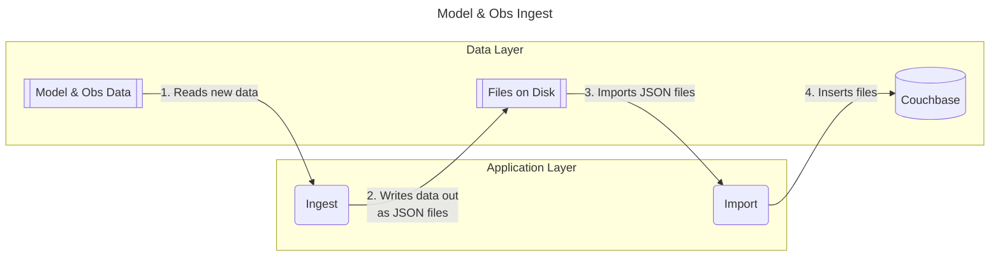
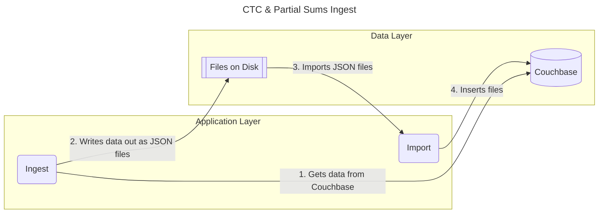

# VxIngest

VxIngest ingests meteorological data from various sources and makes it available in a document database for verification purposes in conjunction with the ["Model Application Toolsuite" (MATS)](https://github.com/noaa-gsl/MATS) application.

## Getting Started

Our ingest process has two components:

* The VxIngest Python application - also referred to as the "ingest"
* The "import" shell script

The ingest program works to consume raw model output and observation data in GRIB & NetCDF format and turn that data into VxIngest's common data format. The ingest program writes the data out to disk as Couchbase JSON documents, along with some log output and Prometheus metrics. The ingest program also works to calculate aggregate statistics on the contents of the Couchbase database, like CTCs & Partial Sums

The import script wraps the Couchbase `cbimport` CLI tool and imports the Couchbase JSON documents created by the "ingest" process into the database.

If you're interested in some diagrams showing the data flow, see the [Diagrams](#diagrams) section

## Usage

VxIngest is containerized for deployment. If you are developing the application, see the [Development Guide](docs/development-guide.md) for information on setting up a development environment; as well as for information on linting, formatting, and testing.

### Using the container

Build the ingest and import images from the local checkout before running them with Docker Compose:

```bash
BUILDVER=dev \
COMMITBRANCH=$(git branch --show-current) \
COMMITSHA=$(git rev-parse HEAD) \
docker compose build ingest import
```

The import image is built for `linux/amd64` because Couchbase's `cbimport` tools are currently distributed as x86_64 binaries. On Apple Silicon, Docker Desktop will build and run that image via emulation.

To run the ingest, you will first need to create a file like the below with the database credentials in `${HOME}/credentials`:

For import if you want Compose to use a different credentials file, set the `CREDENTIALS_FILE` environment variable before running `docker compose`.

`${HOME}/credentials`:

```yaml
cb_host: "url.for.couchbase"
cb_user: "user"
cb_password: "password"
cb_bucket: "vxdata"
cb_scope: "_default"
cb_collection: "METAR"
cacert_file: /path/to/ca_cert_file # optional - needed for Capella clusters
cb_timeout_seconds: 7200
```

The optional cb_timeout_seconds defines the couchbase timeout for queries.
The optional ca_cert_file can be obtained from the Capella management UI.

The cb_host file requires a protocol. For example ... "couchbase://adb-cb1.gsd.esrl.noaa.gov" - because adb-cb1... is a single node cluster. For adb-cb2 (which is one node of a multinode cluster) it would be "couchbases://adb-cb2.gsd.esrl.noaa.gov". Any of the nodes would suffice.

Once that's in place, you can run the ingest with Docker Compose like the example below. The `public` and `data` environment variables point to the input data and the shared working directory mounted into the containers. The ingest writes JSON output, logs, metrics, and transfer tarballs under that shared `data` directory.

```bash
cd /home/amb-verif/VxIngest && \
data=/data-ingest/data \
    public=/public \
    docker compose run -rm ingest \
    -c /run/secrets/CREDENTIALS_FILE -o /opt/data/outdir -l /opt/data/logs -m /opt/data/common/job_metrics -x /opt/data/xfer
```

You can run the "import" via Docker Compose like this example. Use the same value for `data` that you used for the ingest so the import container sees the tarballs written to `xfer/`. The -l (load_dir) and the -t (temp_tar) will be
subdirectories to `data`. The `data` directoy will be mounted in the container as /opt/data_import and load_dir will be /opt/data_import/${load_dir} and the temp_tar_dir will be /opt/data/${temp_tar}.

The output of import will be written to the logs directory under the data definition (in this example /data-ingest/data/logs) specified in the parameters.

In the compose.yaml the CREDENTIALS_FILE is defined to be ${HOME}/credentials by default. You can override this by defining a CREDENTIALS_FILE environment variable that is assigned the path to a different credentials file.
The CACERT_FILE secret path is similarly overrideable via the CACERT_FILE environment variable and is passed into the import container as CACERT_FILE.

```bash
data=/data-ingest/data \
    docker compose run --remove-orphans import \
    -c /run/secrets/CREDENTIALS_FILE -l xfer -t temp_tar
```

If you want an interactive shell in the ingest image for debugging, you can run:

```bash
data=/data-ingest/data \
    public=/public \
    docker compose run shell
```

## Diagrams

Data flow for Model & Observation ingest (GRIB & NetCDF)


```mermaid
---
title: Model & Obs Ingest
---
flowchart LR
    data --> |1. Reads new data| ingest
    ingest --> |2. Writes data out <br>as JSON files| disk
    disk --> |3. Imports JSON files| import
    import --> |4. Inserts files| cb

    subgraph Application Layer
        ingest(Ingest)
        import(Import)
    end
    subgraph Data Layer
        data[[Model & Obs Data]]
        disk[[Files on Disk]]
        cb[(Couchbase)]
    end
```

Data flow for Aggregate Statistics ingest. (CTC & Partial Sum)


```mermaid
---
title: CTC & Partial Sums Ingest
---
flowchart LR
    ingest --> |1. Gets data from Couchbase| cb
    ingest --> |2. Writes data out as JSON files| disk
    disk --> |3. Imports JSON files| import
    import --> |4. Inserts files| cb

    subgraph Application Layer
        ingest(Ingest)
        import(Import)
    end
    subgraph Data Layer
        disk[[Files on Disk]]
        cb[(Couchbase)]
    end
```

## Disclaimer

This repository is a scientific product and is not official communication of the National Oceanic and Atmospheric Administration, or the United States Department of Commerce. All NOAA GitHub project code is provided on an “as is” basis and the user assumes responsibility for its use. Any claims against the Department of Commerce or Department of Commerce bureaus stemming from the use of this GitHub project will be governed by all applicable Federal law. Any reference to specific commercial products, processes, or services by service mark, trademark, manufacturer, or otherwise, does not constitute or imply their endorsement, recommendation or favoring by the Department of Commerce. The Department of Commerce seal and logo, or the seal and logo of a DOC bureau, shall not be used in any manner to imply endorsement of any commercial product or activity by DOC or the United States Government.
