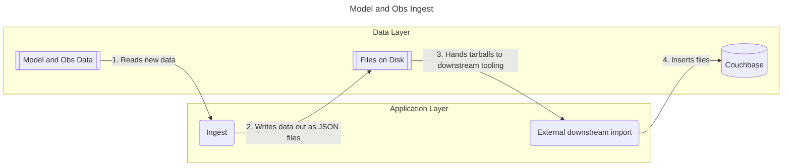
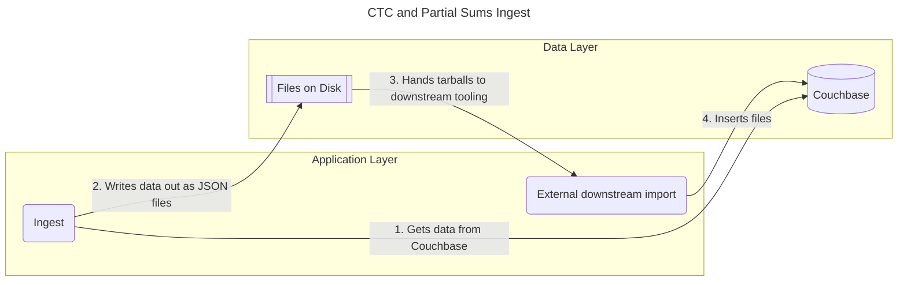

# VxIngest

VxIngest ingests meteorological data from various sources and prepares Couchbase-ready JSON documents for verification workflows used alongside the [Model Application Toolsuite (MATS)](https://github.com/noaa-gsl/MATS).

## Getting Started

This repo currently ships the Python ingest application and related orchestration assets.

- The ingest application reads GRIB2, NetCDF, or Couchbase source data and writes Couchbase-ready JSON documents to disk.
- It also writes logs, Prometheus metrics, and tarballs in a transfer directory.
- Those transfer tarballs are retained for downstream consumers, but the downstream import and metadata-update runtimes are not maintained in this branch.

If you want diagrams of the current data flow, see the [Diagrams](#diagrams).

## Usage

VxIngest is containerized for deployment. If you are developing the application, see [docs/development-guide.md](docs/development-guide.md) for environment setup, linting, formatting, and testing.

### Using the container

#### Building images

VxIngest supports both AMD64 and ARM64 architectures.

Single-architecture local build:

```bash
docker build \
    --build-arg BUILDVER=dev \
    --build-arg COMMITBRANCH=$(git branch --show-current) \
    --build-arg COMMITSHA=$(git rev-parse HEAD) \
    -f ./docker/Dockerfile \
    -t vxingest/ingest:dev \
    .
```

Multi-architecture build with buildx:

```bash
docker buildx build \
    --platform linux/amd64,linux/arm64 \
    --build-arg BUILDVER=dev \
    --build-arg COMMITBRANCH=$(git branch --show-current) \
    --build-arg COMMITSHA=$(git rev-parse HEAD) \
    -f ./docker/Dockerfile \
    -t <registry>/vxingest/ingest:dev \
    --push \
    .
```

Build the development target used by the Compose `test` service:

```bash
docker build \
    --target dev \
    -f ./docker/Dockerfile \
    -t vxingest/ingest:dev-test \
    .
```

### Running the ingest

Create a credentials file such as `${HOME}/credentials`:

```yaml
cb_host: "url.for.couchbase"
cb_user: "user"
cb_password: "password"
cb_bucket: "vxdata"
cb_scope: "_default"
cb_collection: "METAR"
cacert_file: /path/to/ca_cert_file # optional, needed for Capella clusters
cb_timeout_seconds: 7200
```

The optional `cb_timeout_seconds` sets Couchbase query timeouts. The optional `cacert_file` can be obtained from the Capella management UI.

The `cb_host` value must include a protocol such as `couchbase://` or `couchbases://`.

Run the ingest through Docker Compose. The Compose service already supplies the standard output, log, metrics, and transfer directories; you only need to provide the job identifier:

```bash
data=/data-ingest/data \
public=/public \
docker compose run ingest \
    -j JOB-TEST:V01:METAR:NETCDF:OBS
```

If `cb_host` points to a Capella cluster, also set `CACERT_FILE` so the CA certificate PEM is mounted as a secret:

```bash
CACERT_FILE=/path/to/capella-ca.pem \
data=/data-ingest/data \
public=/public \
docker compose run ingest \
    -j JOB-TEST:V01:METAR:NETCDF:OBS
```

The ingest writes JSON output, logs, metrics, and transfer tarballs into the mounted `data` directory.

### Running tests in the container

The Compose `test` service builds the Dockerfile's `dev` target and runs the repository test suite inside that container:

```bash
data=/home/path/to/test-data docker compose run test
```

### Debugging in the container

If you want an interactive shell in the ingest image for debugging:

```bash
data=/data-ingest/data \
public=/public \
docker compose run shell
```

## Diagrams

Data flow for model and observation ingest (GRIB2 and NetCDF):


```mermaid
---
title: Model and Obs Ingest
---
flowchart LR
    data --> |1. Reads new data| ingest
    ingest --> |2. Writes data out as JSON files| disk
    disk --> |3. Hands tarballs to downstream tooling| downstream
    downstream --> |4. Inserts files| cb

    subgraph Application Layer
        ingest(Ingest)
        downstream(External downstream import)
    end
    subgraph Data Layer
        data[[Model and Obs Data]]
        disk[[Files on Disk]]
        cb[(Couchbase)]
    end
```

Data flow for aggregate statistics ingest (CTC and Partial Sums):


```mermaid
---
title: CTC and Partial Sums Ingest
---
flowchart LR
    ingest --> |1. Gets data from Couchbase| cb
    ingest --> |2. Writes data out as JSON files| disk
    disk --> |3. Hands tarballs to downstream tooling| downstream
    downstream --> |4. Inserts files| cb

    subgraph Application Layer
        ingest(Ingest)
        downstream(External downstream import)
    end
    subgraph Data Layer
        disk[[Files on Disk]]
        cb[(Couchbase)]
    end
```

## Disclaimer

This repository is a scientific product and is not official communication of the National Oceanic and Atmospheric Administration, or the United States Department of Commerce. All NOAA GitHub project code is provided on an "as is" basis and the user assumes responsibility for its use. Any claims against the Department of Commerce or Department of Commerce bureaus stemming from the use of this GitHub project will be governed by all applicable Federal law. Any reference to specific commercial products, processes, or services by service mark, trademark, manufacturer, or otherwise, does not constitute or imply their endorsement, recommendation or favoring by the Department of Commerce. The Department of Commerce seal and logo, or the seal and logo of a DOC bureau, shall not be used in any manner to imply endorsement of any commercial product or activity by DOC or the United States Government.
