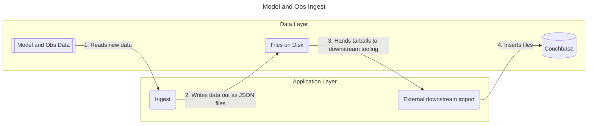
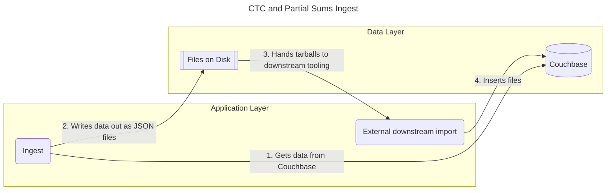

# VxIngest

VxIngest ingests meteorological data from various sources and prepares Couchbase-ready JSON documents for verification workflows used alongside the [Model Application Toolsuite (MATS)](https://github.com/noaa-gsl/MATS).

## Getting Started

This repo currently ships the Python ingest application and related orchestration assets.

- The ingest application reads GRIB2, NetCDF, or Couchbase source data and writes Couchbase-ready JSON documents to disk.
- It also writes logs, Prometheus metrics, and tarballs in a transfer directory.
- Those transfer tarballs are retained for downstream consumers, but the downstream import and metadata-update runtimes are not maintained in this branch.

If you want diagrams of the current data flow, see the [Diagrams](#diagrams).

## Usage

VxIngest is containerized for deployment. If you are developing the application, see [docs/development-guide.md](docs/development-guide.md) for environment setup, linting, formatting, and testing.

### Using the container

#### Building images

VxIngest supports both AMD64 and ARM64 architectures.

Single-architecture local build:

```bash
docker build \
    --build-arg BUILDVER=dev \
    --build-arg COMMITBRANCH=$(git branch --show-current) \
    --build-arg COMMITSHA=$(git rev-parse HEAD) \
    -f ./docker/Dockerfile \
    -t vxingest/ingest:dev \
    .
```

Multi-architecture build with buildx:

```bash
docker buildx build \
    --platform linux/amd64,linux/arm64 \
    --build-arg BUILDVER=dev \
    --build-arg COMMITBRANCH=$(git branch --show-current) \
    --build-arg COMMITSHA=$(git rev-parse HEAD) \
    -f ./docker/Dockerfile \
    -t <registry>/vxingest/ingest:dev \
    --push \
    .
```

Build the development target used by the Compose `test` service:

```bash
docker build \
    --target dev \
    -f ./docker/Dockerfile \
    -t vxingest/ingest:dev-test \
    .
```

### Running the ingest

Create a credentials file such as `${HOME}/credentials`:

```yaml
cb_host: "url.for.couchbase"
cb_user: "user"
cb_password: "password"
cb_bucket: "vxdata"
cb_scope: "_default"
cb_collection: "METAR"
cb_timeout_seconds: 7200
```

The optional `cb_timeout_seconds` sets Couchbase query timeouts.
The `cb_host` value must include a protocol such as `couchbase://` or `couchbases://`.

Run the ingest through Docker Compose. The Compose service already supplies the standard output, log, metrics, and transfer directories; you only need to provide the job identifier:

```bash
data=/data-ingest/data \
public=/public \
docker compose run ingest \
    -j JOB-TEST:V01:METAR:NETCDF:OBS
```

The ingest writes JSON output, logs, metrics, and transfer tarballs into the mounted `data` directory.

#### Testing mode

To run ingest in testing mode, set the `TESTING` environment variable (any value) when running the container. When set, the ingest will process both status='active' and status='test' job documents. When not set, only status='active' documents are processed. This allows test documents to be safely developed and tested without risk of automatic runners (like cron) inadvertently executing them:

```bash
data=/data-ingest/data \
public=/public \
docker compose run -e TESTING=1 ingest \
    -j JOB-TEST:V01:METAR:NETCDF:OBS
```

### Running tests in the container

The Compose `test` service builds the Dockerfile's `dev` target and runs the repository test suite inside that container:

```bash
data=/home/path/to/test-data docker compose run test
```

### Running jobs with the job wrapper script

For production or automation workflows, use [scripts/VXingest_utilities/run_job.sh](scripts/VXingest_utilities/run_job.sh) to submit and process ingest jobs with Docker and automatically import the resulting documents into Couchbase.

The script:

- Orchestrates ingest and import of a single job
- Manages temporary working directories and logs
- Automatically extracts tar.gz archives from ingest output and imports any JSON documents found within
- Handles both ingest output and Couchbase document import
- Requires the `CREDENTIALS_FILE` environment variable to point to a credentials YAML file (see [Running the ingest](#running-the-ingest))

Basic usage:

```bash
export CREDENTIALS_FILE="${HOME}/credentials"
./scripts/VXingest_utilities/run_job.sh JOB-TEST:V01:METAR:NETCDF:OBS
```

Optional environment variables:

- `WORKING_ROOT_DIR` — Root directory for temporary files and logs. Default: `/data-ingest/data/working`
- `PUBLIC_DIR` — Host public directory mounted into ingest as `/public`. Default: `/public`
- `DATA_SOURCE` — Host directory containing raw input files. If set, this directory is mounted read-only into the container. Optional.
- `CONTAINER_DATA_PATH` — Container path where DATA_SOURCE is mounted. Default: same as DATA_SOURCE. Only used if DATA_SOURCE is set.
- `VXINGEST_IMAGE` — Docker image for the ingest step. Default: `ghcr.io/noaa-gsl/vxingest/ingest:latest`
- `LOG_LEVEL` — Log level for both ingest and import steps. Use one of `DEBUG`, `INFO`, `WARNING`, `ERROR`, or `CRITICAL`. Default: `INFO`
- `VXIMPORTER_IMAGE` — Docker image for the import step. Default: `ghcr.io/noaa-gsl/vximporter:latest`
- `VXIMPORTER_WORKERS` — Number of import workers. Default: `16`
- `VXIMPORTER_BATCH_SIZE` — Batch size for imports. Default: `1000`

The script creates logs in `${WORKING_ROOT_DIR}/logs/` with naming pattern `docker-{ingest|import}-{job_id}-{timestamp}.out`.

Example with data source:

```bash
export CREDENTIALS_FILE="${HOME}/credentials"
export DATA_SOURCE="/opt/data/netcdf_to_cb"
./scripts/VXingest_utilities/run_job.sh JS:METAR:OBS:NETCDF-TEST:schedule:job:V01
```

Example with debug logging:

```bash
export CREDENTIALS_FILE="${HOME}/credentials"
export LOG_LEVEL=DEBUG
./scripts/VXingest_utilities/run_job.sh JS:METAR:OBS:NETCDF-TEST:schedule:job:V01
```

### Using Docker Compose directly

The wrapper script uses direct `docker run` calls so it is self-contained for automation. Docker Compose remains supported for development, testing, and interactive debugging through [compose.yaml](compose.yaml). Use Compose when you want the repository-defined `shell`, `test`, or `ingest` services rather than the wrapper's ingest-plus-import workflow.

Example direct Compose ingest run:

```bash
data=/data-ingest/data \
public=/public \
LOG_LEVEL=DEBUG \
docker compose run ingest \
    -j JOB-TEST:V01:METAR:NETCDF:OBS
```

`LOG_LEVEL` controls application logging for the main process and worker processes. If it is unset, VxIngest logs at `INFO`. Invalid values stop startup with an error so misconfigured automation does not silently run at the wrong verbosity. The legacy `DEBUG=true` setting is still honored when `LOG_LEVEL` is not set.

### Debugging in the container

If you want an interactive shell in the ingest image for debugging:

```bash
data=/data-ingest/data \
public=/public \
docker compose run shell
```

### Debugging with a locally built image

To debug VxIngest with a locally built Docker image and DEBUG logging:

1. Build the image locally:

```bash
docker build \
    --build-arg BUILDVER=dev \
    --build-arg COMMITBRANCH=$(git branch --show-current) \
    --build-arg COMMITSHA=$(git rev-parse HEAD) \
    -f ./docker/Dockerfile \
    -t vxingest/ingest:latest \
    .
```

1. Set the log level and image environment variables:

```bash
export LOG_LEVEL=DEBUG
export VXINGEST_IMAGE=vxingest/ingest:latest
export CREDENTIALS_FILE="${HOME}/credentials"
```

1. Run the job wrapper script:

```bash
./scripts/VXingest_utilities/run_job.sh JS:METAR:OBS:NETCDF-TEST:schedule:job:V01
```

The DEBUG logs will be written to `${WORKING_ROOT_DIR}/logs/` (default: `/data-ingest/data/working/logs/`). Check the log files for detailed output including the `get_file_list` debug entries showing which files were discovered and why.

**Note on reprocessing files:** If you need to reprocess files that have already been ingested, you may need to DELETE type "DF" documents from the database that record the file's processing status. The ingest code will NOT process any files that have been recorded in type "DF" documents indicating they have already been processed. Use a query like this to remove the processing record, the extra fields are there to cause the query to make use of proper indexing:

```SQL
DELETE
FROM vxdata._default.METAR
WHERE subset='METAR'
    AND type='DF'
    AND fileType='netcdf'
    AND originType='madis'
    AND url = "/opt/data/netcdf_to_cb/input_files/20250911_1500"
```

Alternatively, you can touch the input data file i.e. ...

```sh
touch /opt/data/netcdf_to_cb/input_files/20250911_1500
```

... which will renew the mtime of the input file making it more recent
than the previously ingested data. This will allow reprocessing as well.

## Tailing the log output from a running contianer

The log files are identified in the output of of the run_job.sh. You can tail these in real time
with ...

```sh
tail -f log_file
```

If you want to tail the log output from the latest running container use...

```bash
docker logs -f "$(docker ps -ql)"
```

which will tail the most recent container.
Alternatively you can examine the running containers with ...

```sh
docker ps
```

and choose a running container (in case there are more than one running container) and then use ...

```sh
docker logs -f container_id
```

## Diagrams

Data flow for model and observation ingest (GRIB2 and NetCDF):


```mermaid
---
title: Model and Obs Ingest
---
flowchart LR
    data --> |1. Reads new data| ingest
    ingest --> |2. Writes data out as JSON files| disk
    disk --> |3. Hands tarballs to downstream tooling| downstream
    downstream --> |4. Inserts files| cb

    subgraph Application Layer
        ingest(Ingest)
        downstream(External downstream import)
    end
    subgraph Data Layer
        data[[Model and Obs Data]]
        disk[[Files on Disk]]
        cb[(Couchbase)]
    end
```

Data flow for aggregate statistics ingest (CTC and Partial Sums):


```mermaid
---
title: CTC and Partial Sums Ingest
---
flowchart LR
    ingest --> |1. Gets data from Couchbase| cb
    ingest --> |2. Writes data out as JSON files| disk
    disk --> |3. Hands tarballs to downstream tooling| downstream
    downstream --> |4. Inserts files| cb

    subgraph Application Layer
        ingest(Ingest)
        downstream(External downstream import)
    end
    subgraph Data Layer
        disk[[Files on Disk]]
        cb[(Couchbase)]
    end
```

## Disclaimer

This repository is a scientific product and is not official communication of the National Oceanic and Atmospheric Administration, or the United States Department of Commerce. All NOAA GitHub project code is provided on an "as is" basis and the user assumes responsibility for its use. Any claims against the Department of Commerce or Department of Commerce bureaus stemming from the use of this GitHub project will be governed by all applicable Federal law. Any reference to specific commercial products, processes, or services by service mark, trademark, manufacturer, or otherwise, does not constitute or imply their endorsement, recommendation or favoring by the Department of Commerce. The Department of Commerce seal and logo, or the seal and logo of a DOC bureau, shall not be used in any manner to imply endorsement of any commercial product or activity by DOC or the United States Government.
